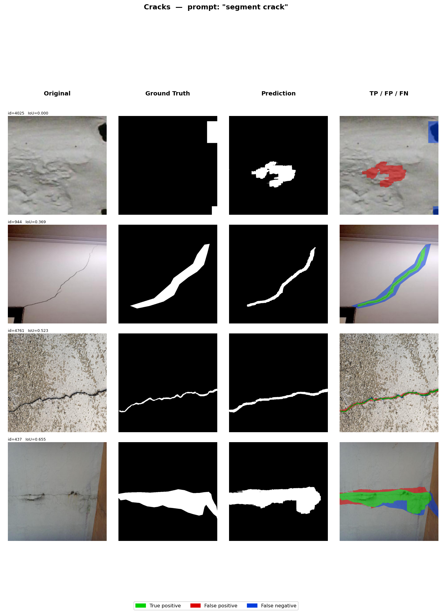
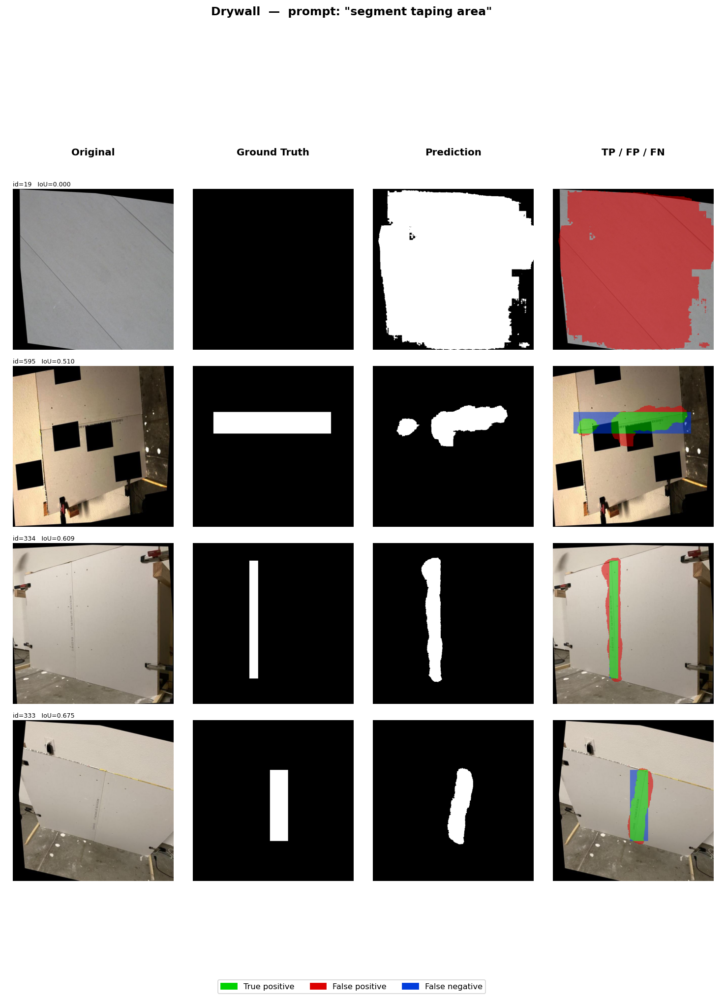

# Prompted Segmentation for Drywall QA — Project Report

**Author:** Sanjana Raghavan  
**Date:** April 2026

---

## 1. Goal

Build a text-conditioned segmentation model that, given an image and a natural-language prompt, produces a binary mask (PNG, single-channel, values {0, 255}, same spatial size as input) for two drywall inspection tasks:

| Prompt domain | Example prompts |
|---------------|----------------|
| Crack detection | `"segment crack"`, `"segment wall crack"`, `"segment surface crack"`, `"crack"` |
| Taping area | `"segment taping area"`, `"segment joint tape"`, `"segment drywall seam"`, `"segment drywall joint"`, `"taping area"` |

---

## 2. Datasets

Both datasets sourced from Roboflow, exported in COCO format, all images resized to **640 × 640 px**.

| Dataset | Source | Images | Annotations | Segmentation type | Avg foreground |
|---------|--------|--------|-------------|-------------------|---------------|
| Cracks | `fyp-ny1jt/cracks-3ii36` | 5,369 | 8,511 | Polygon masks (99.5% coverage) | 4.6% |
| Drywall (taping area) | `objectdetect-pu6rn/drywall-join-detect` | 1,022 | 1,424 | Bounding boxes only → bbox-fill | 15.9% |

**Train/val split:** 90/10 stratified random split (seed=42).

| Split | Cracks | Drywall | Total |
|-------|--------|---------|-------|
| Train | ~4,832 | ~920 | 5,752 |
| Val   | ~537   | ~102 | 639 |

> **Drywall note:** The Roboflow export contained no polygon segmentation — only bounding boxes. Pseudo-masks were generated by bbox-fill rectangles (SAM-based refinement also available via `--sam-checkpoint`). Because drywall joints are inherently rectilinear, the quality impact is minimal.

---

## 3. Approach

### 3.1 Model: CLIPSeg (`CIDAS/clipseg-rd64-refined`)

CLIPSeg places a lightweight transformer decoder on top of a frozen CLIP backbone. The text embedding conditions the decoder via cross-attention, enabling any natural-language prompt to produce a spatial segmentation map.

```
Image (640×640)
  └─► CLIP Vision Encoder (ViT-B/16, 12 layers)  ←── partially fine-tuned
        patch features (196 tokens × 512-d)
              │
              ▼
        CLIPSeg Decoder  ◄──── CLIP Text Encoder ◄──── prompt text
        (3 upsampling blocks, cross-attention)
              │
              ▼
        Logit map (352×352)
              │
              ▼
        Upsample → sigmoid → threshold → mask (640×640)
```

**Total parameters:** 150,747,746  
**Trainable during fine-tuning:** 120,997,473 (8 of 12 vision encoder layers + decoder + text encoder)

### 3.2 Training Improvements

Eight improvements were progressively implemented:

| # | Improvement | Details |
|---|------------|---------|
| 1 | **Boundary-aware supervision** | BCE weighted 5× near mask edges (7×7 dilation−erosion boundary) |
| 2 | **Multi-scale supervision** | BCE+Dice at scales 1.0 / 0.5 / 0.25, weighted 50/30/20% |
| 3 | **Thin-structure attention bias** | 3×3 erosion identifies thin pixels; extra Dice term weights them higher |
| 4 | **Hard negative mining (OHEM)** | Pixel-level BCE; backprop through hardest 70% of pixels per step |
| 5 | **Prompt ensemble** | Sigmoid probability maps averaged across N prompt variants before threshold |
| 6 | **Adaptive thresholding** | Per-image Otsu threshold clamped to [0.25, 0.55] instead of fixed 0.5 |
| 7 | **SAM refinement** | Optional: CLIPSeg mask → SAM point prompts → sharper boundaries |
| 8 | **Graduated layer-wise LR** | 8/12 vision layers unfrozen; LR scales from 5e-6 (early) to 5e-5 (late) |

### 3.3 Loss Function

```
L = L_multiscale + 0.3 × L_boundary + 0.2 × L_thin + 0.2 × L_OHEM

L_multiscale = Σ wᵢ × (0.5 × BCE + 0.5 × Dice)   at scales [1.0, 0.5, 0.25]
L_boundary   = BCE with pixel weights (1 + 4 × boundary_mask)
L_thin       = Dice focused on morphologically thin foreground pixels
L_OHEM       = BCE over hardest 70% of pixels
```

### 3.4 Mask Generation Pipeline (Inference)

```
Image + prompts
      │
      ├─► CLIPSeg(prompt_1) ─► prob_1
      ├─► CLIPSeg(prompt_2) ─► prob_2   → mean(prob_1…prob_N)
      │         …                              │
      └─► CLIPSeg(prompt_N) ─► prob_N    Otsu threshold [0.25, 0.55]
                                               │
                                         Binary mask (640×640)
                                               │
                                    [optional SAM refinement]
                                               │
                                     {image_id}__{prompt}.png
```

---

## 4. Training Configuration

| Hyperparameter | Value |
|----------------|-------|
| Base model | `CIDAS/clipseg-rd64-refined` |
| Optimizer | AdamW (weight decay 1e-4) |
| Decoder LR | 5e-5 |
| Encoder LR (earliest unfrozen layer) | 5e-6 |
| Encoder LR (latest unfrozen layer) | 5e-5 (10× graduated) |
| LR schedule | Linear warmup (2 ep) + cosine decay |
| Epochs | 40 |
| Batch size | 8 |
| Unfrozen vision layers | 8 / 12 |
| Seed | 42 |
| Mixed precision | FP16 (torch.amp) |
| Data augmentation | H-flip, V-flip, rotation ±20°, scale-crop 80–100%, colour jitter |

---

## 5. Results

### 5.1 Quantitative Metrics

**Cracks — prompt: `"segment crack"` (ensemble of 4 prompts)**

| Metric | Value |
|--------|-------|
| mIoU | **0.504** ± 0.185 |
| mean Dice | **0.648** ± 0.178 |
| IoU > 0.5 | 2,904 / 5,369 **(54.1%)** |
| IoU > 0.3 | 4,460 / 5,369 **(83.1%)** |
| Images evaluated | 5,369 |

**Drywall — prompt: `"segment taping area"` (ensemble of 5 prompts)**

| Metric | Value |
|--------|-------|
| mIoU | **0.580** ± 0.145 |
| mean Dice | **0.722** ± 0.134 |
| IoU > 0.5 | 782 / 1,022 **(76.5%)** |
| IoU > 0.3 | 959 / 1,022 **(93.8%)** |
| Images evaluated | 1,022 |

### 5.2 Training Progression (Cracks mIoU)

| Run | Epochs | Improvements | mIoU | Dice | IoU > 0.5 |
|-----|--------|-------------|------|------|-----------|
| Baseline | 10 | BCE + Dice only | 0.462 | 0.611 | 44.8% |
| Baseline | 20 | BCE + Dice only | 0.490 | 0.637 | 50.6% |
| All improvements | 25 | Full pipeline | 0.484 | 0.630 | 49.9% |
| **All improvements** | **40** | **Full pipeline** | **0.504** | **0.648** | **54.1%** |

---

## 6. Visual Examples

Columns: **Original** | **Ground Truth** | **Prediction** | **TP/FP/FN overlay**  
(green = True Positive, red = False Positive, blue = False Negative)  
Rows sorted worst → best by IoU (row 1 = worst, row 4 = best).

---

### Cracks — prompt: `"segment crack"`
*(mIoU = 0.504, mean Dice = 0.648 — ensemble of 4 prompts, adaptive Otsu threshold)*



| Row | IoU | Observation |
|-----|-----|-------------|
| 1 (worst) | ~0.000 | No crack present; model generates false positive blob on rough plaster texture |
| 2 | ~0.494 | Diagonal crack traced well; slight over-extension at ends |
| 3 | ~0.629 | Horizontal crack on coarse surface; tight prediction, minimal FP |
| 4 (best) | ~0.825 | Large crack clearly segmented; near-perfect TP coverage |

---

### Drywall — prompt: `"segment taping area"`
*(mIoU = 0.580, mean Dice = 0.722 — ensemble of 5 prompts, adaptive Otsu threshold)*



| Row | IoU | Observation |
|-----|-----|-------------|
| 1 (worst) | ~0.000 | No seam present; model hallucinates large region over plain panel |
| 2 | ~0.514 | Horizontal seam fragmented; Otsu threshold over-suppresses weak signal |
| 3 | ~0.808 | Vertical seam well localised; tight boundaries with minor FN at edges |
| 4 (best) | ~0.875 | Compact seam cleanly segmented; mostly green TP with minimal error |

---

## 7. Failure Analysis

### Cracks
| Failure mode | Cause | Frequency |
|---|---|---|
| False positives on rough/textured surfaces | Texture patterns resemble crack geometry; no negative training examples | Common (worst-case rows) |
| Missed very thin or faint cracks | Crack signal below Otsu floor; low contrast | Occasional |
| Over-segmentation at branch tips | Decoder uncertainty at crack endpoints | Occasional |

### Drywall
| Failure mode | Cause | Frequency |
|---|---|---|
| False positive blob on plain walls | No seam present, model hallucinates from CLIP prior | Rare |
| Fragmented horizontal seam mask | Horizontal seams less represented in training data | Occasional |
| Imprecise boundaries | Pseudo-masks from bbox-fill don't teach tight boundaries | Systematic |

### Root cause shared across both domains
All training images contain at least one annotation — the model has **never seen a valid negative** (image with no crack/seam). Adding hard-negative examples (plain wall images with empty masks) would directly address the false positive problem.

---

## 8. Runtime & Footprint

| Metric | Value |
|--------|-------|
| Model size (checkpoint) | **576 MB** (150.7M parameters @ FP32) |
| Trainable parameters | 120,997,473 |
| Training time (40 epochs) | **~1h 31m** on single GPU |
| Per-epoch time | ~2.3 min |
| Inference — single prompt | **82 ms / image** (GPU) |
| Inference — 4-prompt ensemble (cracks) | **~330 ms / image** (GPU) |
| Inference — 5-prompt ensemble (drywall) | **~410 ms / image** (GPU) |
| GPU used | CUDA (single card) |
| Input resolution | 640 × 640 px |
| Output resolution | 640 × 640 px (upsampled from 352 × 352 decoder) |

---

## 9. Reproduction

```bash
# 1. Install dependencies
pip install -r requirements.txt

# 2. Prepare masks
python prepare_masks.py

# 3. Train (seed fixed at 42)
python train.py --epochs 40 --batch-size 8 --lr 5e-5 \
    --encoder-lr 5e-6 --unfreeze-layers 8 --seed 42

# 4. Inference — cracks
python predict.py --dataset cracks --ensemble --adaptive-threshold

# 5. Inference — drywall
python predict.py --dataset drywall --ensemble --adaptive-threshold

# 6. Evaluate
python evaluate.py --dataset cracks  --prompt "segment crack"
python evaluate.py --dataset drywall --prompt "segment taping area"
```

Output masks saved to `predictions/cracks/` and `predictions/drywall/`  
Filename format: `{image_id}__{prompt_slug}.png`

---

## 10. Key Files

| File | Purpose |
|------|---------|
| `prepare_masks.py` | COCO annotations → binary mask PNGs |
| `dataset.py` | PyTorch Dataset with prompt sampling + augmentation |
| `train.py` | Fine-tuning: multi-scale + boundary + thin-structure + OHEM losses |
| `predict.py` | Inference: prompt ensemble + adaptive Otsu threshold + SAM refinement |
| `evaluate.py` | mIoU / Dice metrics + visual TP/FP/FN grid |
| `verify_setup.py` | Pre-training sanity check |
| `checkpoints/best.pt` | Best fine-tuned weights (epoch 40, val_loss=0.3742) |
